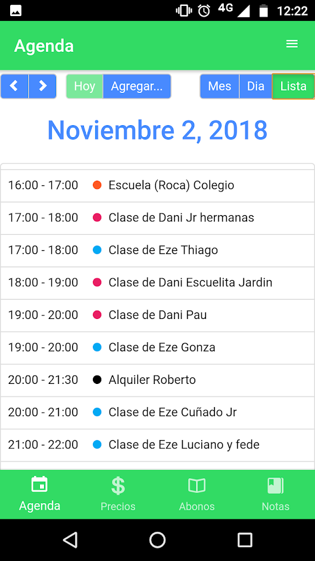
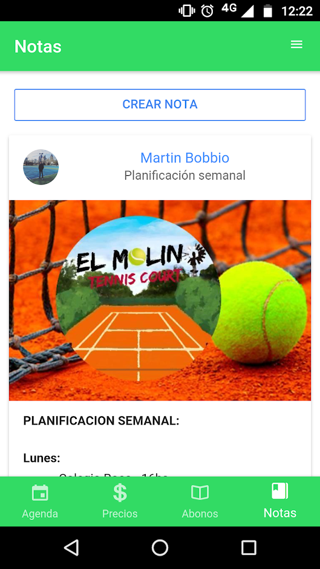
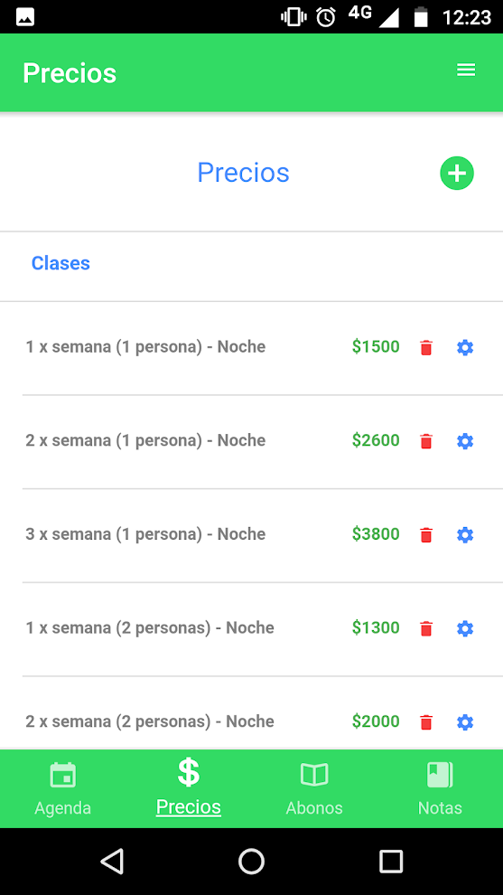
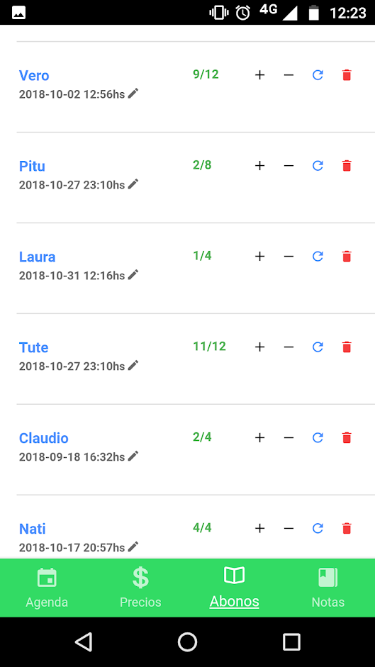

<h1 align="center">
   
  
   
  El Molino - Mobile
   
</h1>
<h4 align="center">
  <a href="https://github.com/martinbobbio/backend-molino-tenis">El Molino - Backend</a>
   -  
  <a href="https://github.com/martinbobbio/frontend-molino-tenis">El Molino - Frontend</a>
</h4>

# Descripción

App para el Molino tenis de Hurlingham.
Utilizada para administrar reservas, clases, alquileres, abonos, etc

# Capturas

### Eventos

### Precios

### Abonos

### Eventos

